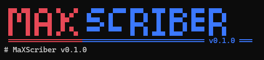

# MaxScriber

[](LICENSE)
[](https://www.python.org/downloads/)
[](https://maxscriber.readthedocs.io/en/latest/?badge=latest)
[](CHANGELOG.md)



MaxScriber is a universal, adaptive pipeline for extracting, tabulating, and analyzing structured clinical data from heterogeneous medical laboratory report PDFs. It uses dynamic YAML schemas to map layout structures and extract metrics, so new report formats can be supported by writing a schema rather than custom parser code per hospital.

> **Project status:** MaxScriber is in early development (pre-1.0). The CLI interface and output formats may still change between releases. See [CHANGELOG.md](CHANGELOG.md) for what's actually working in each version.

## Features

- Schema-driven PDF extraction — define a report layout once in YAML, no per-format parser code
- Structured tabular output (Excel and database export)
- Duplicate detection and QC on extracted records
- Longitudinal tracking across repeated patient reports
- Severity stratification of lab values
- R-based plot generation for extracted metrics
- Interactive terminal UI (TUI) for managing schemas and inspecting records

## Requirements

- Python 3.9 or later
- R (required only for the plot-generation feature; the extraction and tabulation pipeline runs without it)

## Installation

Clone the repository and install in editable mode:

```bash
git clone https://github.com/vaishnavpvarma/maxscriber.git
cd maxscriber
pip install -e .
```

A Bioconda package is planned for a future release — see [ROADMAP.md](ROADMAP.md).

## Quickstart

### 1. Transcribe PDF reports

Transcribe clinical reports in an input directory and export structured Excel and database outputs using a defined schema:

```bash
maxscriber run --schema example_schema --input-dir ./raw_pdfs --output-dir ./results
```

### 2. Launch the terminal dashboard

Launch the interactive TUI to manage schemas, load extraction jobs, and inspect patient records:

```bash
maxscriber tui
```

## Documentation

Full documentation, including schema authoring, advanced configuration, and the complete CLI reference, is available on Read the Docs:

**[https://maxscriber.readthedocs.io](https://maxscriber.readthedocs.io)**

## Roadmap

Planned work, including the TUI redesign and Bioconda packaging, is tracked in [ROADMAP.md](ROADMAP.md).

## Citation

If MaxScriber is useful in your research, please cite this repository. A formal citation format (BibTeX / `CITATION.cff`) will be added once a corresponding publication or release is available.

## License

Distributed under the MIT License. See [LICENSE](LICENSE) for details.
